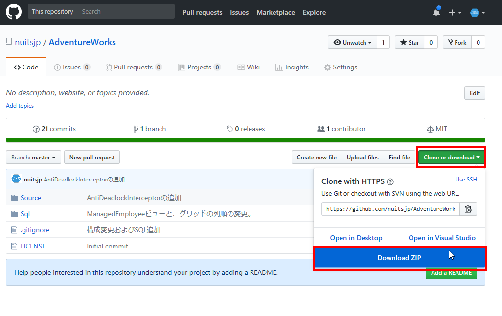
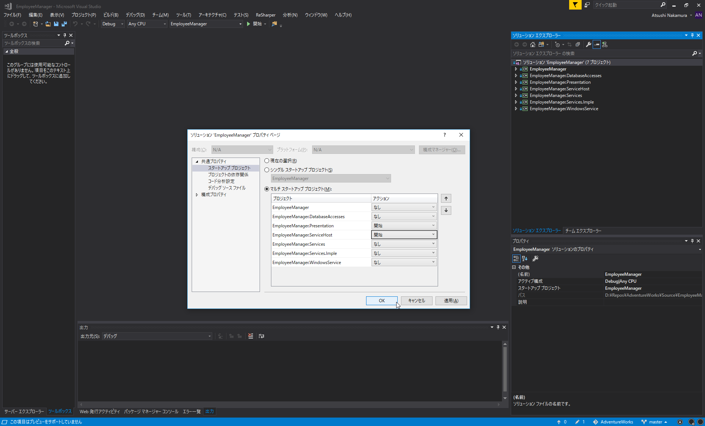
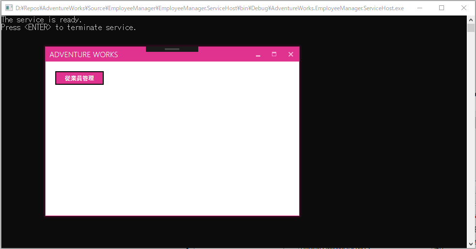

# 本アプリケーションの前提条件

* Visual Studio 2017  
* .NET Framework 4.7.1  
* SPREAD for WPF 2.0J

# 本アプリケーションの実行方法

次の手順で環境構築を行い、実行します。

1. SPREAD for WPFのインストール  
1. SQL Server 2017をインストールし、サンプルDB AdventureWorksをセットアップする
2. 本リポジトリをクローンもしくはダウンロードする  
3. SQL Serverをセットアップする  
4. ソリューションのスタートアップ設定を変更する

## SPREAD for WPFのインストール

本アプリケーションはSPREAD for WPFがインストールされている必要があります。以下のサイトから体験版を入手してインストールしましょう。

[SPREAD for WPF 2.0J](https://www.grapecity.co.jp/developer/spread-wpf)

## SQL Server 2017をインストールし、サンプルDB AdventureWorksをセットアップする

以下に詳細な手順を記載しています。ご確認ください。

[SQL Server でサンプルDBを利用する](http://www.nuits.jp/entry/sqlserver-sample-db-install)

## 本リポジトリをクローンもしくはダウンロードする

クローンか、次の図のようにZIPをダウンロードして解凍してください。

  

## SQL Serverをセットアップする

本アプリケーションを実行する上で、いくつかAdventureWorksデータベースを更新する必要があります。  

更新するためには[SQLフォルダ内のInitDatabase.sql](https://github.com/nuitsjp/AdventureWorks/blob/master/Sql/InitDatabase.sql)を実行する必要がありますが、その際にSQLを少し修正する必要があります。

SQLの先頭にはつぎのような記述があります。

```sql
DECLARE @LoginID nvarchar(max) = 'YOUR_ACCOUNT'
```

この部分の「YOUR_ACCOUNT」を実行するPCおよびアカウントの「マシン名\アカウント名」に書き換えてから実行してください。

本アプリケーションでは統合Windows認証を用いて認証処理を実装しているため、事前にデータベースに実行アカウントを登録しておく必要があります。

InitDatabase.sqlではそれ以外にいくつかのマスタテーブルとビューの追加を行います。

## ソリューションのスタートアップ設定を変更する

本アプリケーションは、サーバーサイドとクライアントサイドの二つのプロセスの実行が必要になります。そのため、ソリューションのスタートアップ設定を変更する必要があります。

EmployeeManager.slnを開き、ソリューションを右クリックしてプロパティを開いてください。その上で、つぎの図のように「マルチスタートアッププロジェクト」の設定を行ってください。



その上でF5キーを押下してデバッグ実行を行い、つぎのように表示されたら設定は無事完了です。



あとは実際に利用してみて、ソースコードを確認ください。
